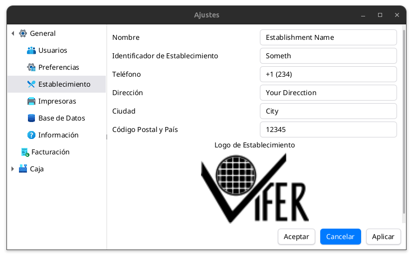

# Establecimiento

Es crucial que todos los campos de esta pantalla de ajustes sean 
correctos y no contengan errores. Diferentes **plugins** utilizarán 
esta información como datos predeterminados del establecimiento, 
los cuales pueden reflejarse en facturas u otros documentos legales.

### Campos de configuración

- **Nombre:** El nombre legal completo del establecimiento.
- **Identificador:** Número de identificación fiscal (NIF o CIF) de la empresa.
- **Teléfono:** Número de contacto para atención al cliente.
- **Dirección:** Dirección física del establecimiento.
- **Logo:** Al hacer clic sobre la imagen, se abrirá un selector de archivos. Los formatos de imagen soportados son:
  - BMP
  - GIF
  - JPEG
  - PNG
